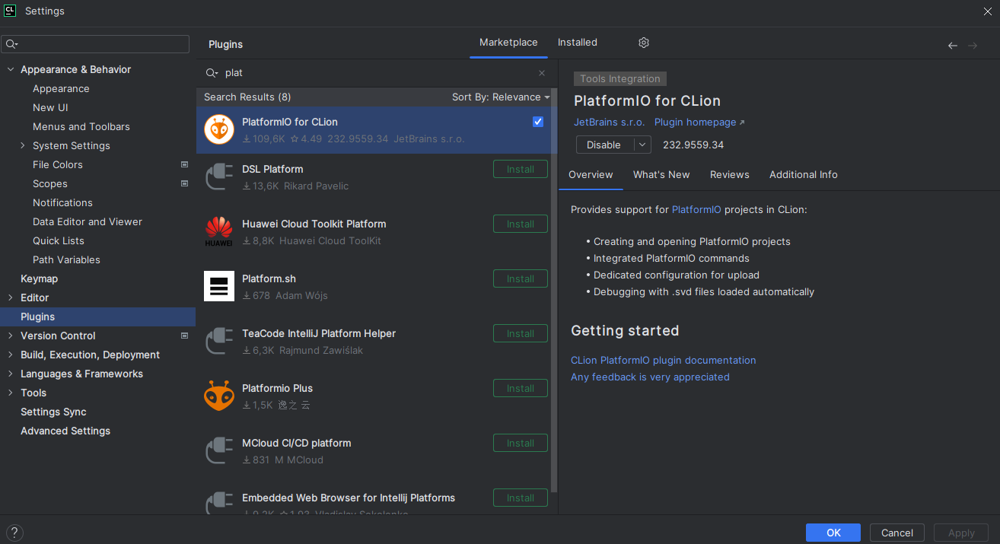
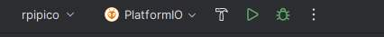

# How to compile
In order to compile the Neuron Wired project, we need to have install the platformio CLI to do so you can follow the instructions in this link. 

## Prerequisites

### Python installation
First, you need to install python to do so follow the instructions in the installation process.
[Python download webpage](https://www.python.org/downloads/release/python-3115/)

### Platformio installation
First, you need to install platformio to do so follow the instructions in the installation process.
[Platformio download webpage](https://docs.platformio.org/en/latest/integration/ide/pioide.html)

# Manual compilation
1. Open the terminal and compile it with
`pio run -e rpipico`
# Clion compilation
1. First install the platformio extension in CLion
    
2. Open the project

3. And just build the program pressing the hammer
    
